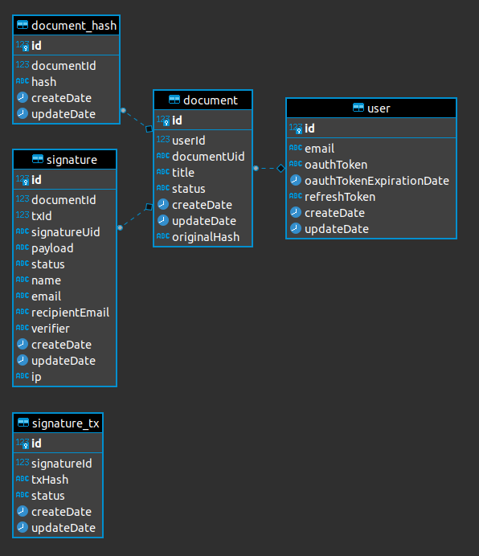

# caspersign-server

This is a part of the [CasperSign](https://blog.chronologic.network/caspersign-immutable-document-signatures-on-the-blockchain-65edc4969bf0) project.

This repository holds the back end services for the application.

## Database diagram

## Project overview

The CasperSign project consists of the following repositories:

- https://github.com/chronologic/caspersign-app-ui
- https://github.com/chronologic/caspersign-validator-ui
- https://github.com/chronologic/caspersign-signer-ui
- https://github.com/chronologic/caspersign-server (this repository)
- https://github.com/chronologic/caspersign-contract

## 🔧 Environment variables

This repo uses [`dotenv`](https://www.npmjs.com/package/dotenv) to load environment variables.

For development, and `.env` file should be created based on the `.env.example` template file. The `.env` file should never be commited.

In production, environment variables can be injected directly.

Below is a list of possible environment variables.

| Name                    | Type      | Default | Description                                                                                    |
| ----------------------- | --------- | ------- | ---------------------------------------------------------------------------------------------- |
| `LOG_LEVEL`             | `string`  | `info`  | Standard [`npm`](https://github.com/winstonjs/winston#logging-levels) log level                |
| `DATABASE_URL`          | `string`  |         | PostgreSQL connection string                                                                   |
| `HS_TEST_MODE`          | `boolean` |         | HelloSign API [test mode](https://app.hellosign.com/api/reference#Objects)                     |
| `HS_CLIENT_ID`          | `string`  |         | HelloSign [client_id](https://app.hellosign.com/api/reference#Objects)                         |
| `HS_API_KEY`            | `string`  |         | HelloSign [API key](https://app.hellosign.com/api/reference#Objects)                           |
| `HS_OAUTH_SECRET`       | `string`  |         | HelloSign [OAuth secret](https://app.hellosign.com/api/reference#Objects)                      |
| `CASPER_PUB_PEM`        | `string`  |         | Casper account public key in PEM format                                                        |
| `CASPER_PK_PEM`         | `string`  |         | Casper account private key in PEM format                                                       |
| `CASPER_NODE_URL`       | `string`  |         | URL pointing to Casper RPC node                                                                |
| `CASPER_CHAIN_NAME`     | `string`  |         | `casper` / `casper-test` / ...                                                                 |
| `CASPER_CONTRACT_HASH`  | `string`  |         | Hash of [CasperSign smart contract](https://github.com/chronologic/caspersign-contract)        |
| `POSTSIGN_REDIRECT_URL` | `string`  |         | URL pointing to [CasperSign validator](https://github.com/chronologic/caspersign-validator-ui) |

## :construction: Building

Run `npm run build`.

## Development

Run `npm start`.
